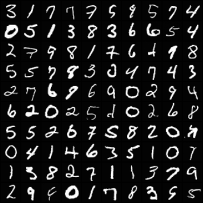
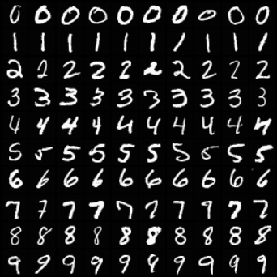
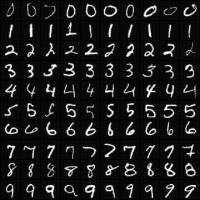
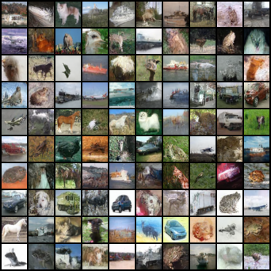
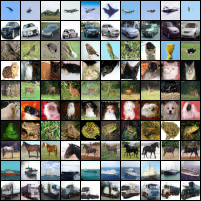
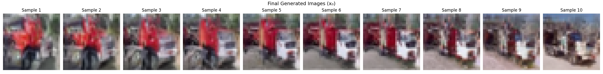

# Vanilla Diffusion: From Noise to Data

This project implements **Vanilla Diffusion** models from scratch, exploring the transition from Gaussian noise to structured data. By leveraging a noise schedule over **T** timesteps, the model learns to reverse the corruption process, effectively "hallucinating" images from thin air.

The project highlights the contrast between the relatively simple visual features of **MNIST** and the complex, high-dimensional distributions of  **CIFAR-10** , demonstrating how different sampling strategies impact generation quality.

---

## 🖼️ Results

### MNIST

| Unconditional                                     | Conditional                               | Classifier-Free Guidance                              |
| ------------------------------------------------- | ----------------------------------------- | ----------------------------------------------------- |
|  |  |  |

### CIFAR10

| Unconditional                                     | Conditional                               | Classifier-Free Guidance                              |
| ------------------------------------------------- | ----------------------------------------- | ----------------------------------------------------- |
|  |  |  |

### DDIM Interpolation

---

## 🧠 Theory & Implementation

### The Diffusion Process

In a Diffusion model, we corrupt an image by iteratively adding noise according to a predefined **noise schedule** over **T** timesteps. For this project, I implemented two distinct schedules:

* **Linear Schedule:** Utilized for MNIST, where the complexity is lower.
* **Cosine Schedule:** Utilized for CIFAR-10 to provide a smoother degradation of information, which helps in capturing finer details.

### Training Logic

The training objective is straightforward: the model is tasked with **predicting the specific noise** added to the original image at any given timestep **t**. By minimizing the difference between the predicted noise and the actual noise, the model implicitly learns the structure of the data manifold.

### Sampling Techniques

Sampling is the most critical phase of the diffusion pipeline. I implemented several techniques to observe how they navigate the latent space:

* **Ancestral Sampling (DDPM):** The standard stochastic reverse process.
* **Langevin Dynamics:** Sampling using the score function to refine the trajectory.
* **Predictor-Corrector Sampling:** A hybrid approach using Ancestral sampling as the predictor and Langevin dynamics as the corrector.
* **Classifier-Free Guidance (CFG):** A technique to improve sample quality and alignment by trade-offing diversity for fidelity without needing a separate classifier.
* **Fast Deterministic DDIM Sampling:** A non-Markovian acceleration technique that allows for much faster generation with fewer steps.
* **Image Interpolation:** Navigating the latent space to smoothly transition between two generated images.

---

## 🔬 Key Observations

* **Complexity Variance:** Training on MNIST was significantly easier due to its simple visual features. CIFAR-10, with its varied textures and colors, required more precise tuning.
* **Distribution Modeling:** By observing the sampling process, one can see how the model precisely mirrors the data distribution in reverse—starting from a spherical Gaussian and "condensing" into the data manifold.
* **The **x**0** Clamping Trick: For CIFAR-10, I found it necessary to **predict **x**0** and clamp it to the **[**−**1**,**+**1**]** range during the reverse steps. Without this, the mean of the distribution gradually shifts over time, leading to "color bleeding" or completely garbage generation.
